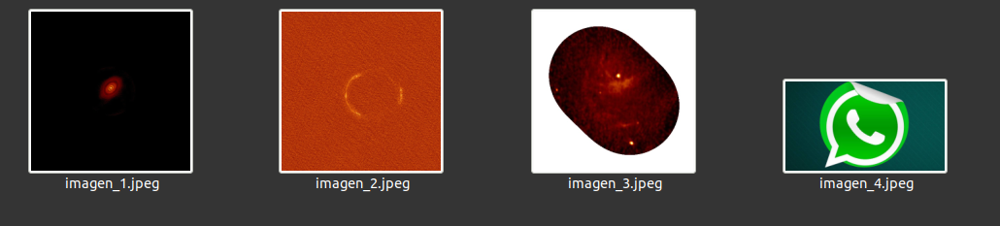
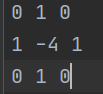
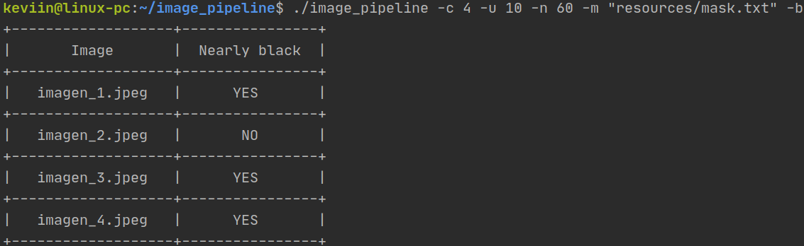
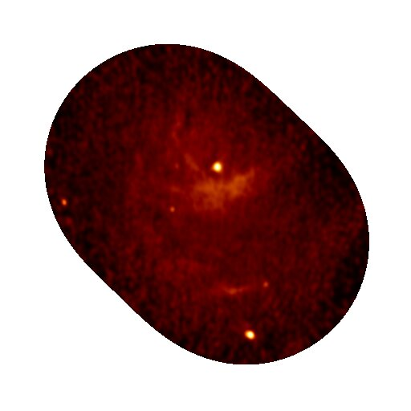
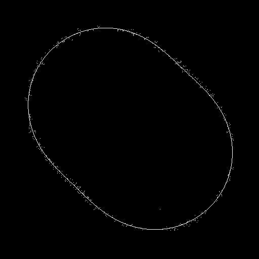

# Descarga y compilación

    $ git clone https://github.com/Arefer/image_pipeline.git
    $ cd image_pipeline
    $ make all

# USO
`./image_pipeline -c <num_im> -u <umbral> -n <umbral> -m <path> [-b]`

Argumentos:

    -c <num_im> : Numero de imagenes a procesar.
    -u <umbral> : Umbral de binarizacion. Numero entre 0 y 255.
    -n <umbral> : Porcentaje para umbral de clasificacion. Numero entre 0 y 100
    -m <path>   : Ruta al archivo de la mascara. El archivo de la mascara debe ser de 3x3 enteros.
    -b          : Mostrar resultados de clasificacion.

# Etapa 1 - Lectura
Las imagenes estaran almacenadas en binario con formato jpg.  Habran n imagenes y sus nombres tendran el mismo prefijo 
seguido de un numero correlativo.  Es decir,  los nombres seran `imagen_1.jpg`,  `imagen_2.jpg`, ..., `imagen_i.jpg`, ... ,`imagen_n.jpg`.

# Etapa 2 - Filtro escala de grises
La imagen leída en el paso 1, es transformada desde RGB a una imagen de 1 canal.

# Etapa 3 - Convolución
La imagen resultante de la etapa 2 es convolucionada con la máscara, cuya ruta es pasada como argumento del programa.
Esta máscara es almacenada en un archivo de texto y debe contener una matriz de 3x3 enteros. En donde cada columna es 
separada por un espacio, y las filas por salto de línea. En `resources/mask.txt` se encuentra un ejemplo de una máscara
utilizada para un filtro de detección de bordes de Laplace.
 

# Etapa 4 - Binarización
La imagen resultante de la convolución, es binarizada, esto es: se compara cada pixel (que es de 1 canal) con cierto umbral
(0 <= umbral <= 255), entonces si pixel > umbral -> pixel = 255, caso contrario -> pixel = 0.

# Etapa 5 - Clasificación
Se calcula el porcentaje de pixeles negros que contiene la imagen binarizada. Si este porcenaje es mayor a cierto umbral,
entonces se clasifica la imagen como "Nearly black".

# Etapa 6 - Escritura en disco
Se escribe la imagen resultante en la etapa 4 en la ruta `imagen_i_bin.jpeg`.

 

